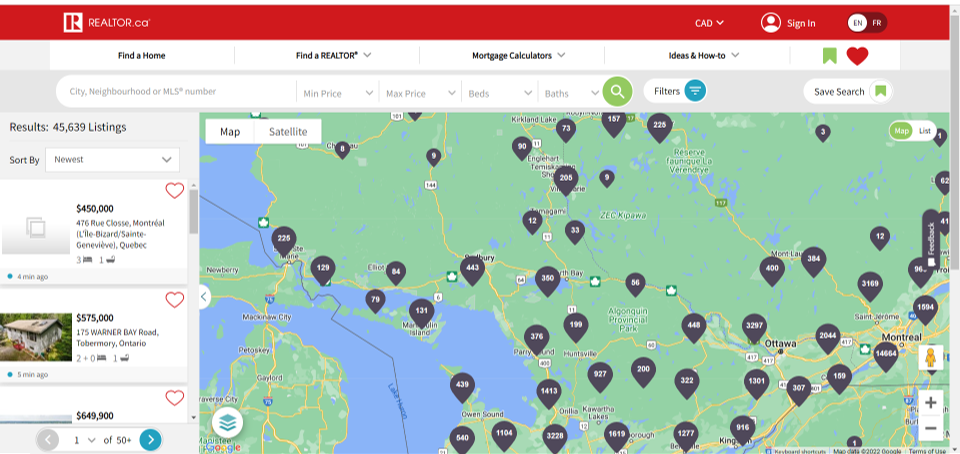

# House-Price-Prediction-with-Multivariate-Linear-Regression-Model



# Overview
The real estate market has grown significantly in recent years, given changes in the ways people are buying, selling, and financing their houses. Machine learning and artificial intelligence can make revolutionary changes in the housing market. Machine learning algorithms can rapidly organize large quantities of data, sorting through property values, debt information, key home factors, and even consumer information. For instance, through a price-prediction model, a home buyer or sellers have an opportunity to decide wisely.

# Business Understanding
Realtor.com is a real estate listing website operated by the News Corp subsidiary Move, Inc. It was relaunched in 1996 as a public website displaying property listings. Now they want to offer valuations of houses using machine learning techniques to their customers. The company asked to design a model that be used to predict house sales in King County, Washington State, USA using Multiple Linear Regression (MLR). The dataset consisted of historic data of houses sold between May 2014 to May 2015. They need this model to guide real estate investors who use the platform to have a better decision on which house is more valuable to invest.

# Methodology

When modeling for prediction, we are trying to accurately predict at all costs. Thus, we use all available features (and most likely engineer new features). And, we are less concerned about the coefficients of these features and instead focus on the overall accuracy of our model.
The general research strategy in this project is to use OSEMN framework on the King County House Sales dataset. The process includes the below steps:

- Obtain data

- Scrub data

- Explore data

- Model data

- Interpret model

## Obtain data

The very first step of the project is to obtain data. We obtain the data that we need from 'kc_house_data.csv' file. Obtaining data starts with importing needed libraries and modules in our framework. Our file is CSV (comma-separated values) file that can be opened using  `pd.read_csv()` method. 

## Scrub data

After obtaining data, the next immediate thing to do is scrubbing data that make them operational. In this way, dealing with messy data means dealing with missing values, inconsistent formatting, malformed records, or nonsensical outliers. The beginning of data cleaning is to print a concise summary of a DataFrame with `.info()` method and view a small sample of the DataFrame object with `.head()` method. Through the `.info()` method we access valuable information about missing values and datatype. `.isnull()` is a method that helps us determine the missing value and based on the percentage of them or necessity of them, decided on delete (`.dropna()` method) them or fill (`.fillna()` method) them with suitable values. With `.duplicated()` method we also check the duplications and drop them through `.drop_duplicates()` method.

## Explore data

Once our data is ready to be used, and right before jumping into AI and Machine Learning, we should examine the data to make sense of them. This step will help stakeholders to get accurate, actionable insights from our data analytic. To achieve that, we will need to explore the data by inspecting some analytical questions. This step includes below substeps:

- Inspect the data and its properties: Different data types like numerical data, categorical data, ordinal and nominal data require different treatments.
- Compute descriptive statistics:  Extract features and test significant variables
- Data visualization: Identify significant patterns and trends in our data

The below questions might help better to have insight into our database.

### Question 1.  How does the age of the houses impact the house price?
To answer this question, houses were categorized based on their age. Then their price and mean price were plotted based on age groups. 


### Insights

The results from our exploration inform us that:
- Houses in different age groups have a high distribution of prices. 
- Most of the houses in the market are younger than 45 years.
- Houses younger than 45 years have a higher average price.
- By increasing the age of the house by more than 83 years the house average price increasing. 

### Recommendation

> Older houses have the potential to introduce as vintage houses. This could attract customers to these houses. 


### Question 2. How does house condition impact the house price? 
To answer this question, the relation of house prices with the square footage of the house was plotted based on different house conditions.


### Insights

The results from our exploration inform us that:
- House price and square footage of the house have a relatively linear relation. 
- By increasing the square footage of the house prices increase
- Most of the houses are in average condition
- A very good condition in comparison to the square footage of the house has a lower impact on house prices

### Recommendation
> In all house conditions, the square footage of the house has a direct impact on the house price. The average condition has the potential to be sell without needing to renovate the house. 

## Model Data
The first step was to build a "baseline model" from the dataset. Any decisions on how to change features were compared against a baseline model to see if the changes have improved the model or not. Below techniques that were tried to improve the regression model was listed:

- Transform categorical variables
- Check outliers and remove them
- Check the Multicollinearity of features and remove them
- Feature scaling and normalization
- Check interactions between features

After covering these modifications, multiple linear regression model was built using the Statsmodels and Scikit-Learn libraries. In the next step, below metrics for evaluation linear regression were assessed:

- Adjusted R squared:  Measures variation explained by only the independent variables that affect the dependent variable
- Coefficients: Describe the mathematical relationship between each independent variable and the dependent variable.
- P-values: Indicate whether the relationships are statistically significant
- Mean Squared Error (MSE): The most common metric for regression tasks is MSE. It is the average squared difference between the estimated values and the actual value.

## Interpret model


- Adjusted R squared: 

  >Through the final model, the Adj R squared value was increased by an entire thousandth. The baseline model Adj R is 0.675. And the final model Adj R is 0.691 which means 69.1% of the variations in price 𝑦 are explained by the features in our model. It is not a strong R square. But the coefficients of the variables are quite strong.

- Coefficients:

  >Most variables have high values for coefficients and 'grade_13_Mansion' has the highest coefficient. Other determiners for house price are waterfront views, condition, floors, age, and bathrooms.

- P-values:

  >All the p-values are quite low, which indicates there is sufficient evidence in the sample to conclude that a correlation exists.

- Mean Squared Error (MSE): 

  >The model underestimated 21.93% of house prices by over 100,000 and overestimated 26.32%  of house prices by over 100,000. 
  
  
  
  ## Repository Structure


```
├── Code : student.ipynb includ modeling
├── Data : Data used for modeling, includes 'kc_house_data.csv' file
├── Images : Images used in Phase 2 Project Presentation.pdf and README
├── Phase 2 Project Presentation.pdf : Presentation for stakeholders
└── README.md : Project information and repository structure
```
